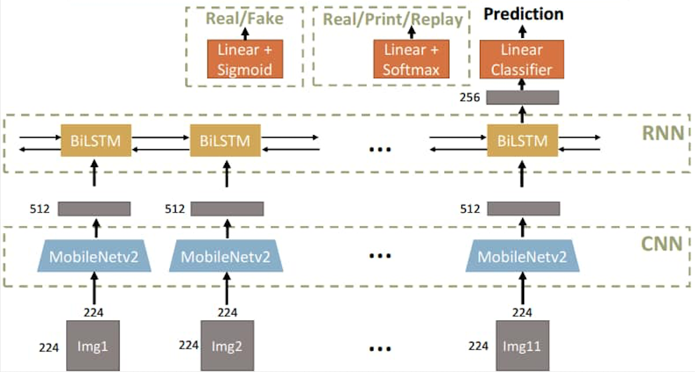

# Face Anti-Spoofing

**Author: Pin-Ying Wu, Pei-Ying Lin, Zi-Ting Chou, Chun-Tin Wu.**

**Table of contents**
- Overview
- Proposed Method
- Code
- Results


## Overview
### Task
In general, face anti-spoofing is a classification task.

**1. Real/Fake Classification**
- Real: Face images which are directly captured by cameras.
- Fake: Face images which are remade from printed photos, replay-videos, etc.
Label 0 represents "Real" and label 1 represent "Fake", respectively.

**2. Three-Class Classification (Real/Print/Replay)**
- For the training data (videos are named "{phone}_{session}_{human ID}_{access type}"), access type 1 represents "Real", while 2, 3 represent "Print" and 4, 5 are "Replay".
- Label 0 represents "Real" and label 1, 2 represent "Print" and "Replay", respectively.
 <!--> -->


### Datasets
**1. Oulu-NPU**
- 11 frames are sampled from each video, which are captured by 6 phones, 3 acquisition conditions and 5 access types (Real, Print1, Print2, Replay1, Replay2). For our main task, the binary classification task, we label both Print and Replay as Fake.

**2. SiW (for testing)**
- 10 frames are sampled from each video.

### Highlights of this project
- We adopt **weighted Focal Loss** to address the data imbalance issue.
- We leverage **sequential modeling** to learn temporal information.
- We adopt **feature pretraining** to learn a more generalized feature.  

Our model with all these components achieves **satisfactory performance on both Oulu-NPU (99.3%) and SiW (99.3%) dataset**. On the three-class classification task, **our method achieves 76.3% accuracy on SiW dataset**.

## Proposed Method

### Architecture
- Our model is composed of two modules, a CNN to extract spatial features for input images and a RNN to learn temporal information.  

    1) CNN: We adopt **MobileNetv2** with ImageNet pretrained weights as the feature extractor, which is followed by a linear layer that converts the feature dimension from 1280 to 512.
    2) RNN: We choose a two-layer **bidirectional LSTM** as our RNN module, since it can model sequential information bidirectionally. The final prediction is produced from passing the last output of RNN through a linear layer with Sigmoid and Softmax activation function for Task1 (Real/Fake) and Task2 (Real/Print/Replay) respectively.

 <!--> -->


- Although the whole network can be trained end-to-end, the back propagation path for CNN could be very long, especially for the former layers of CNN.
- As a result, we divide our training process into two stages:  

    1) Feature Pretraining: To learn a more generalized CNN feature, we augment the data with the pipeline of random crop from 256x256 to 224x224, random horizontal flip and random rotation within 15 degrees. We adopt image-based sampling across all the sequences and treat each image as individual data for CNN input, which is trained for 30 epochs.
    2) Sequential Modeling: In this stage, the CNN and RNN are trained end-toend for 90 epochs, where the CNN is initialized with the pretrained weight from the first stage. We sample 8 sequences per batch, each sequence consists of 11 image frames without using data augmentation. This stage aims to learn the temporal information of the data.


### Loss Function
The quantity of Real and Fake training data is highly imbalanced (1:4), which may lead to imbalanced classification problem.  

To address this issue, we adopt **weighted Focal Loss** as our loss function and assign the weight for Real class, which is 0.8 in Real/Fake Classification Task to balance the influence of the two classes, according to the ratio of Real and Fake data.  

For Real/Print/Replay Classification Task, we use 0.5/0.25/0.25 as the weight.

## Code
### Prerequisites
```
pip3 install -r requirements.txt
```

### Data Preparation
We provide 2 shell scripts for downloading and extracting the dataset.
```
bash ./get_dataset_SiW.sh
bash ./get_dataset_oulu.sh
```
### Training
- **Real/Fake:**
    1) Finetune MobileNetv2 with ImageNet pretrained weights.
    run `bash ./train_cnn_task1.sh`
    2) Train the CNN-RNN model end-to-end.
    run `bash ./train_task1.sh`

- **Real/Print/Replay:**
    1) Finetune MobileNetv2 with ImageNet pretrained weights.
    run `bash ./train_cnn_task2.sh`
    2) Train the CNN-RNN model end-to-end.
    run `bash ./train_task2.sh`

### Checkpoints
| Real/Fake | Real/Print/Replay |
|:---:|:---:|
| [Task1_model](https://www.dropbox.com/s/blbdwdslyaaxv8d/Task1_last_checkpoint.pkl?dl=1)  |  [Task2_model](https://www.dropbox.com/s/kn6n37zfhquluks/Task2_last_checkpoint.pkl?dl=1)  |


### Evaluation
Predict labels of the images sampled from videos in the testing set(one label per video) and output a `.csv` file.
Calculate AUC (Area Under ROC Curve) between the predicted result and the ground truth (the higher, the better).

#### Run Real/Fake Testing
```
python3 main_task1.py --phase test --checkpoint <checkpoint> --batch_size 32 --test_dir <path_to_test_img_dir> --out_csv <path_to_output_csv>
```

#### Run Real/Print/Replay Testing
```
python3 main_task2.py --phase test --checkpoint <checkpoint> --batch_size 32 --test_dir <path_to_test_img_dir> --out_csv <path_to_output_csv>
```

## Results
### Real or Fake Classification:
- Oulu-NPU (AUC): **0.99294**
- SiW (AUC): **0.99249**
### Real/Print/Replay Classification:
- SiW (ACC): **0.76260**


 <!--> -->
<!---->


 <!--> -->
 <!---->
